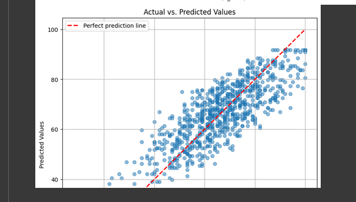
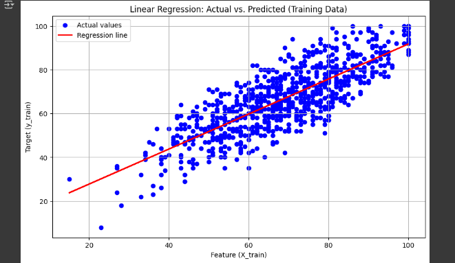

# TibebAI

*Tibeb* means **wisdom** in Amharic.  
This repository contains machine learning experiments focused on predicting **student performance** using regression models.  

Developed as part of the **Elevvo Machine Learning Internship Program**.  

---

## Project Overview
This project explores the relationship between **study hours** and **exam scores** using the [Student Performance dataset](https://www.kaggle.com/datasets/spscientist/students-performance-in-exams).  
The goal is to apply regression techniques to model, predict, and evaluate student outcomes.  

---

## Workflow
The notebook is organized into the following main steps:

1. **Installing Dependencies**  
   - Required Python libraries for data analysis and machine learning.  

2. **Data Cleaning & Visualization**  
   - Download dataset from Kaggle using the API  
   - Unzip and load data into Pandas  
   - Inspect datatypes and missing values  
   - Handle outliers (IQR method)  
   - Visualize features to understand distributions  

3. **Splitting the Dataset**  
   - Train/test split to prepare for modeling  

4. **Training Linear Regression Model**  
   - Import Linear Regression from `scikit-learn`  
   - Create model instance and fit with training data  
   - Make predictions on test data  
   - Evaluate model using metrics: **MAE, RMSE, R²**  

5. **Visualizing Results**  
   - Plot regression line  
   - Scatter plot of actual vs predicted values  

---

## Tools & Libraries
- Python  
- Pandas  
- Matplotlib  
- Scikit-learn  
- Kaggle API  

---

## Covered Topics
- Regression (Linear & Polynomial)  
- Model evaluation metrics (MAE, RMSE, R²)  
- Data cleaning & handling outliers  
- Data visualization  

---

## Repository Structure
```

TibebAI/
│── data/              # datasets (not uploaded if large)
│── notebooks/         # Google Colab / Jupyter notebooks
│── scripts/           # Python scripts for modular code
│── results/           # plots, model outputs, evaluation metrics
│── README.md          # project overview

```

---

## Showcase
- [GitHub Repository](https://github.com/Mr-Ndi/TibebAI)  
- [Google Colab Notebook Link](https://colab.research.google.com/drive/1tzRZ3TgFjph3g4QpG21_IHqjO9r3AP_B#scrollTo=DQONsDVvkguD)  

---

## Example Results
- **Predicted vs Actual Scores** scatter plot  
 

- **Regression Line** visualization  
 


## Future Work
- Experiment with polynomial regression for better fit  
- Add more features (sleep, participation, parental support, etc.)  
- Try advanced models: Random Forest, Gradient Boosting, Neural Networks  
- Deploy model as a simple web app using Streamlit/Flask  

---

## Inspiration
This project is named **TibebAI** to highlight the value of **wisdom** (*tibeb* in Amharic) in both learning and technology.  

---

## Internship Info
This work was completed as part of the **Elevvo Machine Learning Internship Program (August 2025)**.  
The program emphasizes real-world projects, personalized feedback, and professional portfolio building.  
```